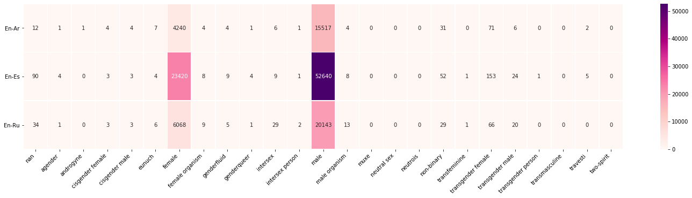

# OccGen_dataset
OccGen dataset and its metadata, we have two **usecases** for our toolkit.
The translations_HR_data.csv which represents the parallel data of EN, ES, AR, RU.
The translations_LR_data.csv which represents the parallel data of EN, SW.

All the previous data is annotated and is ready to be used for **evaluation**.

The OccGen toolkit is available in this github link:
https://github.com/mt-upc/OccGen_toolkit/

**Training data** is released under the following links:

En-Ar 122k: https://drive.google.com/file/d/18SP18I-9wb0H_ibrdP9eBc3hVfgk4q9X/view?usp=sharing

En-Es 1M: https://drive.google.com/file/d/1wahfqTiEgD89wHqnZuq2X4syDk15EgTz/view?usp=sharing

En-Ru 433k:https://drive.google.com/file/d/16KnpUWtbCkoXOEIwUJKFuYqK8woQPZDg/view?usp=sharing

**Gender distribution** in our training data can be seen in the below heatmap:

Gender definitions extracted from **Wikipedia**.